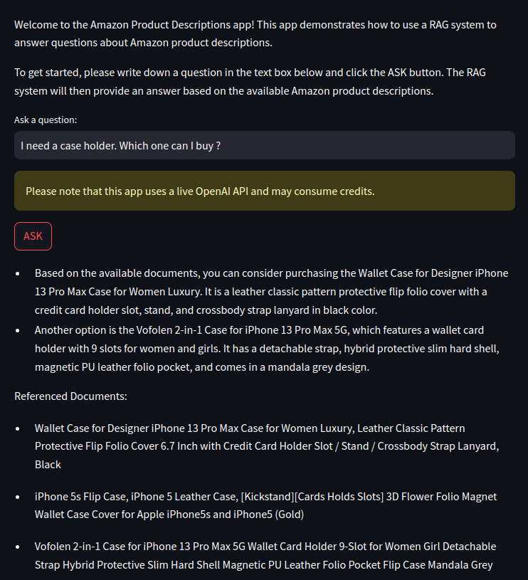
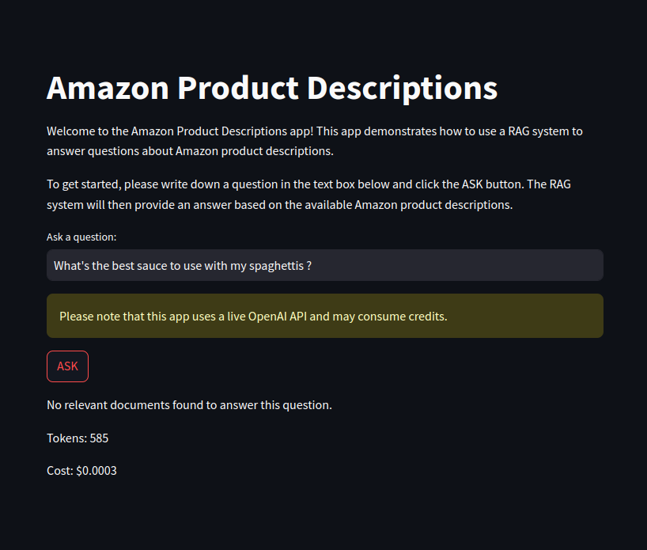

# Amazon Reviews Analysis Projects

These projects focus on developing two distinct systems: a cluster and sentiments analysis based on reviews provided,
and a RAG architecture for product descriptions. I wanted to analyze Amazon product data in different ways.

## Project 1: Review Analysis

### Storage and Processing Requirements

the dataset only contains 1000 reviews from Amazon Review Dataset 2023. The memory usage got pretty high because of the
NLP models - had to keep an eye on that during development.

### Data Processing Implementation

I started testing with different SpaCy models. I ended up using `en_core_web_sm` because the bigger ones (`_md` and
`_lg`) didn't really help with my small dataset. Finally, I had to build a custom token validation system to clean up
the noise in the data.

### Topic Modeling Architecture

I tried two different clustering methods:

K-means worked best for me:

- Played with TF-IDF until `min_df=20`, `max_df=0.95` gave good results
- Tested different `k` values between 2 and 20
- Found `k=8` separated the topics nicely

DBSCAN, on the other hand, was kind of a dead end:

- Tested eps values between `0.1` and `1.0`
- Tried different min_samples (2, 3, 5, 10)
- Data just didn't work well with it

### Sentiment Analysis Structure

I went with `nlptown/bert-base-multilingual-uncased-sentiment` and built a custom DataLoader. You can find all the
correlation metrics and results in the step 3 notebook.

## Project 2: RAG System

### Technical Architecture

Put together these main parts:

- ChromaDB for the vector stuff
- `all-MiniLM-L6-v2` for embeddings
- `GPT-3.5-turbo` as the LLM
- Streamlit for the frontend

### Implementation Details

For text processing:

- Chunks of 512 chars max
- 128 chars overlap

For the responses:

- Set temperature to 0.0 to avoid random stuff
- Top_p at 1.0 to keep all options open

You can check `test_different_parameters.py` to see how I tested these settings.

### System Deployment

```bash
git clone https://github.com/charlotte-waegeneire/nlp_gen_ai.git
pip install -r requirements.txt
cd projet-2_amazon-descriptions && streamlit run app.py
```

Note: Don't forget to add your OpenAI API key in .env
Note²: Streamlit gets weird with paths, so make sure you're in the right directory first

### What the interface looks like




### Performance Monitoring

Keep track of:

- Where the information comes from (documents referred)
- How many tokens we're using
- Each query cost

## Future Enhancements

### Project 1

I would like to see how Sentence Transformers compares to TF-IDF - it might be interesting, and give even better results.

### Project 2

I'm thinking it's already a good start, but I'd like to see how it performs with more complex questions. If I had to try
to make it better, I would see to add a bigger document dataset, with a few other topics to see how it performs.